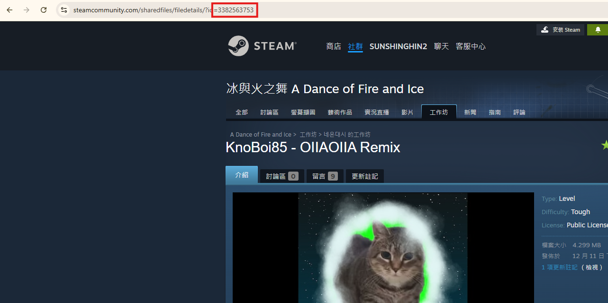

# ADOFAITools
A repo contain bunch of useful python script to help you do many thing in ADOFAI (A dance of fire and ice)

## Requirement:
1. Python >= 3.9
2. os package (import os)
3. re package (import re)
4. shutil package (import shutil)

## Usage:

### Convert new to old version of level map

This can help you play newer level in older ADOFAI such as mobile ADOFAI editor or older version of ADOFAI in PC

1. Download this repo as zip and extract it
2. Put your higher version of .adofai file into the "./OldVersion" folder(dir)
3. Run the main.py file
4. Enter your version in the console that you want to change to (e.g. 6)
5. Convert complete!

### Import map

This can help you import level without searching through the folder

1. Download this repo as zip and extract it
2. Put your level that you want to import to 'ImportLevel' file.The level you want to import should be in folder format.Inside should contain of .adofai file
3. Run the importLevel.py file
4. Choose a mode(easy/advanced)
5. Enter your dummy level steam id

6. (ONLY ADVANCED MODE) Enter your drive that ADOFAI is installed
7. Import complete!

## Online execution

This project is running live on repl.it(But it does not support import level)! You can also use it here: [Repl.it](https://replit.com/@sunshinghin3/ADOFAITools)

## Edit(Advanced)

You can also customize your folder path to anything you want

(var)path = higher version folder
(var)outputpath = output folder
(var)importLevelpath = import level folder

## Planning

-Website version

## Notes

Thanks you for using this project.Hope you have a nice ADOFAI journey!

## MIT license

[MIT](./LICENSE)
